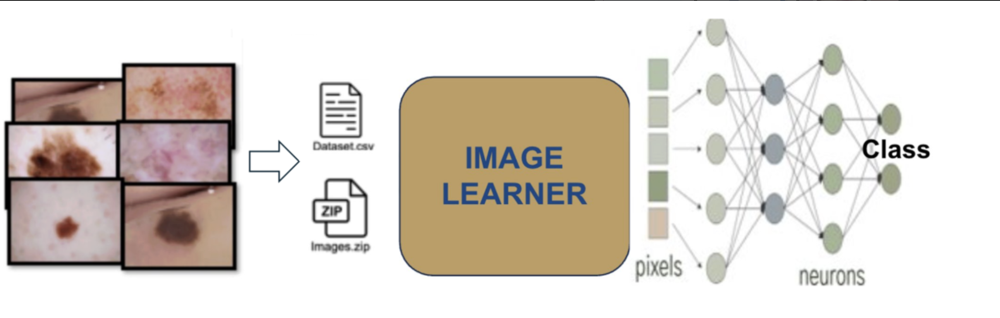
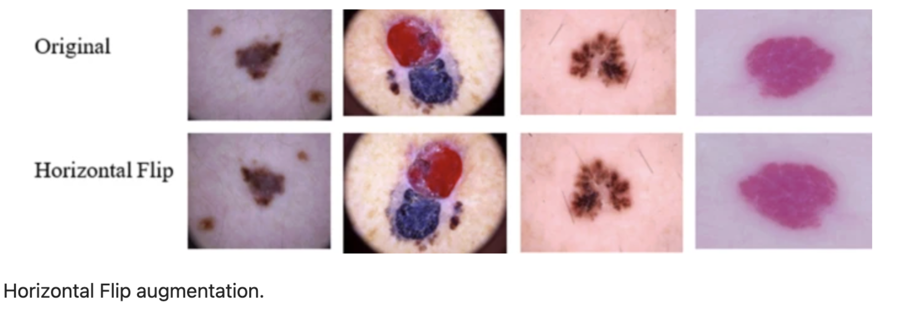
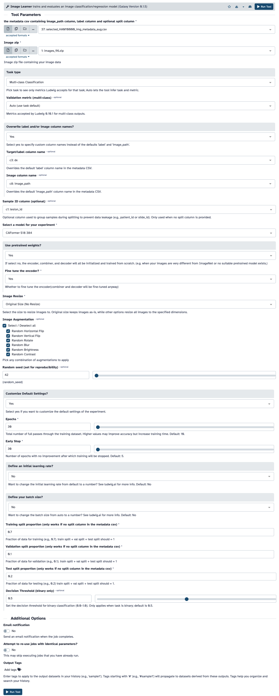
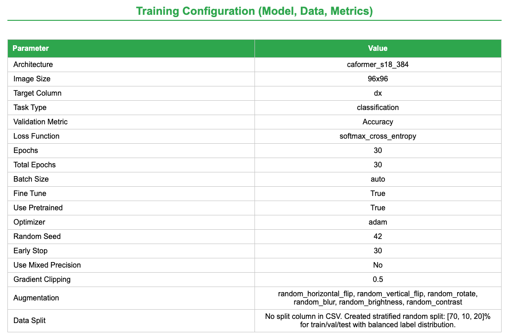
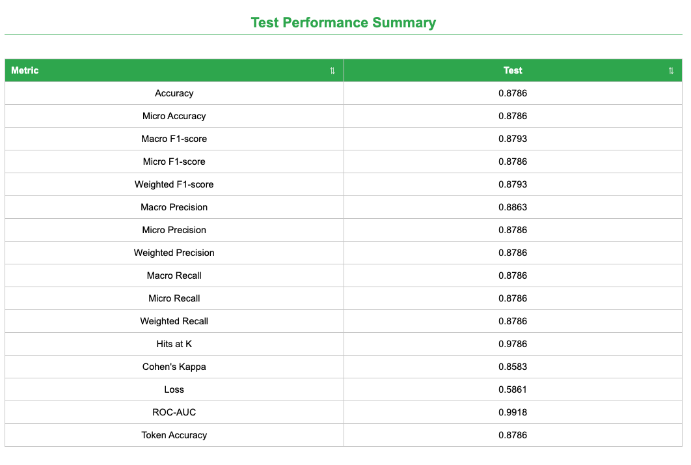
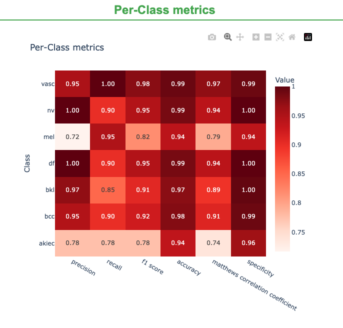
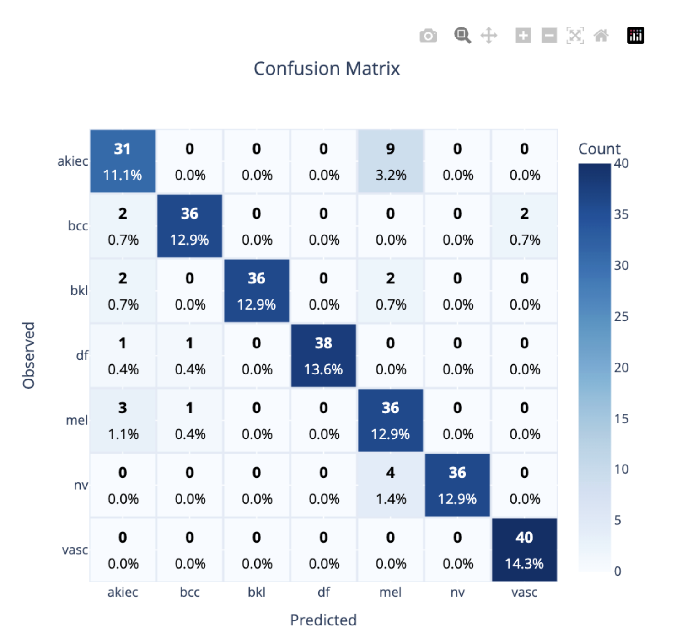
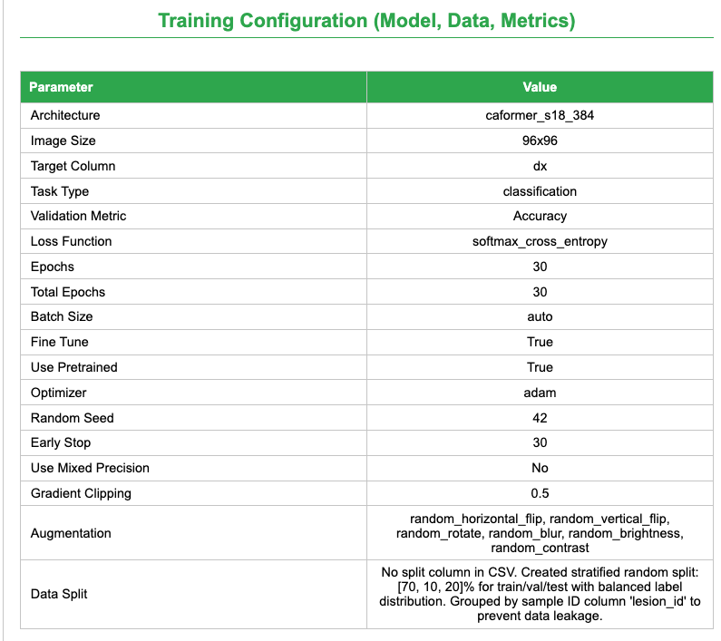
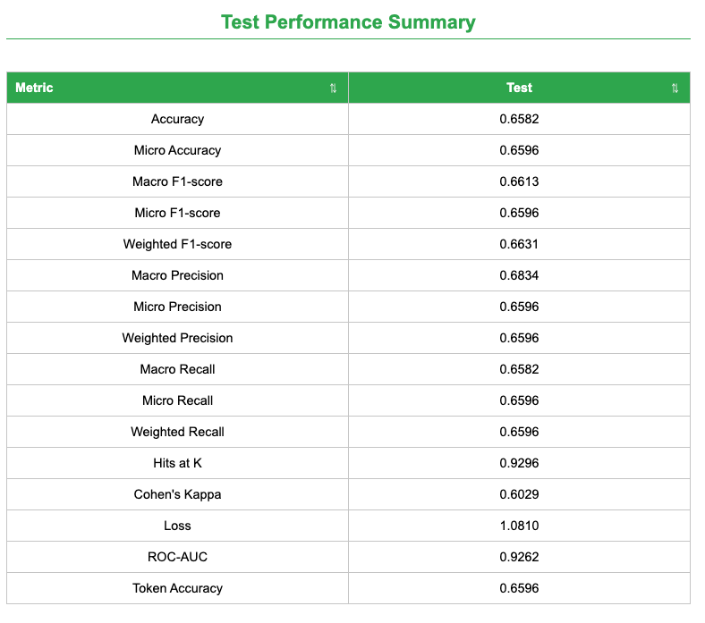

In this tutorial, we will use the HAM10000 ("Human Against Machine with 10,000 training images") dataset to develop a deep learning classifier for dermoscopic skin lesion classification. The goal is to accurately classify seven types of pigmented skin lesions using the GLEAM Image Learner tool.

To achieve this, we will follow three essential steps: (i) upload the HAM10000 images and metadata to Galaxy, (ii) set up and run the Image Learner tool to train a deep learning model, and (iii) evaluate the model's predictive performance by analyzing key performance metrics such as accuracy, ROC-AUC, and confusion matrices.



> <agenda-title></agenda-title>
>
> In this tutorial, we will cover:
>
> 1. TOC
> {:toc}
>
{: .agenda}

> <comment-title>Background</comment-title>
>
> The [HAM10000 dataset](https://zenodo.org/records/17114688) is a preprocessed subset of the original HAM10000 collection, following the methodology described by . The dataset covers seven types of pigmented skin lesions:
> 1. Melanoma (mel)
> 2. Melanocytic nevus (nv)
> 3. Basal cell carcinoma (bcc)
> 4. Actinic keratosis (akiec)
> 5. Benign keratosis (bkl)
> 6. Dermatofibroma (df)
> 7. Vascular lesion (vasc)
>
> To address class imbalance in the original dataset, we applied preprocessing steps.
>
{:  .comment}

# Dataset Preprocessing and Composition

The dataset used in this tutorial has been preprocessed following the methodology from  to create a balanced training set suitable for deep learning.

## Preprocessing Steps

Starting from the original HAM10000 dataset (10,015 images with severe class imbalance), we applied the following preprocessing:

### Step 1: Image Selection
- Selected 100 images per class from the original dataset
- Ensured balanced representation across all 7 lesion types

### Step 2: Image Resizing
- Resized all images to 96×96 pixels
- Standardized format as PNG for consistent processing

### Step 3: Data Augmentation
- Applied horizontal flip augmentation to each image
- Generated 200 images per class (100 original + 100 flipped)
- **Total dataset: 1,400 images** (200 × 7 classes)

This preprocessing addresses the severe class imbalance in the original HAM10000 dataset where melanocytic nevi represented 67% of images while dermatofibroma represented only 1.1%.

## Balanced Dataset Composition

The preprocessed dataset provides balanced representation:

| Lesion Type | Images | Percentage |
|---|---|---|
| Melanocytic nevus (nv) | 200 | 14.3% |
| Melanoma (mel) | 200 | 14.3% |
| Basal cell carcinoma (bcc) | 200 | 14.3% |
| Actinic keratosis (akiec) | 200 | 14.3% |
| Benign keratosis (bkl) | 200 | 14.3% |
| Dermatofibroma (df) | 200 | 14.3% |
| Vascular lesion (vasc) | 200 | 14.3% |
| **Total** | **1,400** | **100%** |

This balanced dataset allows the Image Learner model to learn effectively from all lesion types without bias toward the majority class.

## Metadata Columns (HAM10000 CSV)

The metadata CSV now includes additional fields while keeping the same number of samples and the same flip augmentation strategy. Each row corresponds to one image file.

| Column | Description |
|---|---|
| `lesion_id` | Lesion identifier used to group original and augmented images from the same lesion. |
| `image_id` | Image identifier from the source dataset (shared by original and flipped versions). |
| `dx` | Diagnosis label (target class). |
| `dx_type` | Diagnosis confirmation method (for example, `histo`). |
| `age` | Patient age in years. |
| `sex` | Patient sex (`male`/`female`/`unknown`). |
| `localization` | Anatomical site of the lesion. |
| `image_path` | Image filename within the image ZIP. |

> <tip-title>Why Horizontal Flip Augmentation?</tip-title>
>
> Following the preprocessing pipeline described by , **horizontal flip augmentation** is applied during dataset preparation. Horizontal flips:
>
> - Improve robustness to lesion orientation and acquisition variability  
> - Increase effective training diversity without collecting additional images  
> - Help reduce sensitivity to class- and pose-specific patterns  
> - Preserve diagnostically relevant structures while introducing harmless variation  
>
> In , this preprocessing strategy (including horizontal flips) is associated with improved HAM10000 skin-lesion classification performance (reported accuracy: 95.18%).
>
> 
>
{: .tip}

# Using Image Learner Tool

## Prepare environment and get the data 

> <comment-title>Dataset Preprocessing</comment-title>
>
> The dataset available on Zenodo has been preprocessed following  methodology. 
>
{:  .comment}

> <hands-on-title> Environment and Data Upload </hands-on-title>
>
> 1. Create a new history for this tutorial. If you are not inspired, you can name it *HAM10000 Image Classification*.
>
>    
>
> 2. Import the dataset files from Zenodo
>
>    ```
>    https://zenodo.org/records/18394055/files/selected_HAM10000_img_metadata_aug.csv
>    https://zenodo.org/records/18394055/files/skin_image.zip
>    ```
>
>    
>
>    > <tip-title>Data Type</tip-title>
>    > - For the `.zip` file, set the datatype to `zip`
>    > - For the `.csv` file, leave as `Auto-Detect` (it will be recognized as tabular)
>    >
>    {: .tip}
>
> 3. Check that the data formats are assigned correctly:
>    - The `.zip` file should have type `zip`
>    - The `.csv` file should have type `tabular`
>
>    If they are not, follow the Changing the datatype tip:
>
>    
>
> 4. Add tags to the datasets for better organization:
>    - Add tag `HAM10000_images` to the skin_image.zip file
>    - Add tag `HAM10000_metadata` to the image_metadata_new.csv file
>
>    
>
{: .hands_on}

# Model Configuration in GLEAM Image Learner

## Tool setup and run

After uploading the dataset, configure the Image Learner parameters as follows. These settings are based on best practices for dermoscopic image classification and have been optimized for the HAM10000 dataset.

> <hands-on-title>Configure Image Learner for HAM10000</hands-on-title>
>
> 1.  with the following parameters:
>    -  *The metadata csv containing image_path column, label column*: `image_metadata_new.csv`
>    -  *Image zip*: `skin_image.zip`
>    -  *Task Type*: `Multi-class Classification`
>    -  *Overwrite label and/or image column names?*: `Yes`
>    -  *Target/label column name*: `c3: dx`
>    -  *Image column name*: `c8: image_path`
>    -  *Select a model for your experiment*: `CAFormer S18 384`
>    -  *Image Augmentation*: `Select all`
>    -  *Customize Default Settings*: `Yes`
>    -  *Epochs*: `30`
>    -  *Early Stop*: `30`
>
> 2. Run training and review the generated evaluation report.
>
{: .hands_on}

These settings are based on best practices for image classification and have been optimized for the HAM10000 dataset.

> <tip-title>Recommended Image Learner configuration (and why)</tip-title>
>
> | Parameter | Value | Rationale |
> |---|---|---|
> | Task Type | Classification | Multi-class image classification task |
> | Label column | `dx` | Target diagnosis label |
> | Image column | `image_path` | Image filename in the ZIP archive |
> | Model Name | caformer_s18_384 | Efficient transformer-based model ([CAFormer S18 384](https://github.com/sail-sg/metaformer/blob/main/metaformer_baselines.py)) |
> | Epochs | 30 | Sufficient for convergence without overfitting |
> | Early Stop | 30 | Stop when validation metrics stall to avoid overfitting |
> | Fine Tune | True | Leverage pre-trained features for better performance |
> | Use Pretrained | True | Transfer learning from ImageNet-trained weights |
> | Learning Rate | 0.001 | Conservative learning rate for fine-tuning |
> | Random Seed | 42 | Reproducible results across runs |
> | Data Split | 70/10/20 | Standard split for training/validation/test (automatically applied when no split column exists in metadata CSV) |
> | Data Augmentation | Horizontal and Vertical Flip; Rotate; Blur; Brightness; Contrast | Improve generalization |
{: .tip}

> <tip-title>Data Split Configuration</tip-title>
>
> The Image Learner tool automatically applies a **stratified 70/10/20 train/validation/test split** by default when no split column is present in the metadata CSV file. Per-class counts can differ by a few samples due to rounding. This ensures balanced representation of all classes across the three datasets. The stratified split maintains the same class distribution in each split, which is particularly important for imbalanced datasets. If you want to use a custom split, you can add a `split` column to your metadata CSV with values 0 (train), 1 (validation), or 2 (test).
>
{: .tip}



## Tool Output Files

After training and testing your model, you should see several new files in your history list:

- **Image Learner Trained Model (`ludwig_model`)**: A reusable model bundle that includes the model configuration JSONs and model weights.

- **Image Learner Model Report (HTML)**: An interactive report that summarizes configuration, metrics, and plots.

- **Image Learner Predictions/Stats/Plots (collection)**: A list collection containing:
  - `predictions.csv` with model predictions and confidence scores
  - JSON files (for example `training_statistics.json`, `test_statistics.json`, `description.json`) with experiment metadata and metrics
  - PNG plots from `visualizations/train` and `visualizations/test`, plus feature importance example images
  - `feature_importance_examples.zip` bundling the feature importance examples

For this tutorial, we will focus on the Image Learner Model Report and the performance metrics.

# Image Learner Model Report

The Image Learner HTML report provides a comprehensive and interactive overview of the trained model's performance. It is organized into three tabs that separate configuration, training/validation diagnostics, and test results.

## Config and Overall Performance Summary

This tab combines dataset composition, overall metrics, and configuration details:

- **Dataset Overview**: Sample counts per class and split (train/validation/test). For regression tasks, only split counts are shown.
- **Model Performance Summary**: A sortable table of metrics across train, validation, and test splits.
- **Training Configuration**: Model architecture, image size, augmentation, split strategy, optimizer, learning rate, epochs, early stopping, and random seed.
- **Metrics Help**: A "Help" button that opens a glossary explaining each metric.



## Training and Validation Results

This tab focuses on optimization dynamics and validation diagnostics:

- **Train/Validation Performance Summary**: Side-by-side metrics for train vs. validation.
- **Learning Curves**: Loss/accuracy/F1/ROC-AUC (as applicable) and overfitting gap plots across epochs.
- **Validation Diagnostics**: Prediction confidence distributions and, for binary tasks, a threshold selection plot.

## Test Results

The test tab provides final evaluation plots and metrics:

- **Test Performance Summary**: Test-only metrics table.
- **Classification Diagnostics**: Confusion matrix, ROC/PR curves, and per-class metric plots.
- **Prediction Confidence**: Test-set confidence distributions.
- **Grad-CAM Heatmaps**: Visual explanations for convolutional backbones when available.



These weighted metrics indicate balanced performance across classes under the explicitly balanced split. The report also includes ROC-AUC and Cohen's Kappa for additional discrimination and agreement context.

### Per-class Metrics

The report summarizes performance **for each lesion class** using a heatmap of key classification metrics. Rows correspond to classes (e.g., `akiec`, `bcc`, `bkl`, `df`, `mel`, `nv`, `vasc`) and columns correspond to evaluation metrics. Darker cells indicate stronger performance (values closer to 1.0).

- **Precision**: of the images predicted as a class, how many are correct (higher = fewer false positives).
- **Recall**: of the true images of a class, how many were found (higher = fewer false negatives).
- **F1 score**: balance of precision and recall.
- **Accuracy**: class-wise correctness under the one-vs-rest view reported by the tool.
- **Matthews correlation coefficient (MCC)**: correlation-style score robust to class imbalance (higher is better).
- **Specificity**: how well the model avoids labeling other classes as this class (higher = fewer false positives).

Use this view to quickly spot classes that are consistently strong across metrics (darker row) versus classes where performance lags in specific dimensions (lighter cells), guiding targeted follow-ups (e.g., more data, label review, or augmentation).



### Confusion Matrix

The confusion matrix provides a detailed breakdown of correct and incorrect predictions for each class, highlighting which lesion types are most frequently confused.



> <tip-title>Interpreting the Confusion Matrix</tip-title>
>
> - **Diagonal elements**: Correct predictions (True Positives and True Negatives)
> - **Off-diagonal elements**: Misclassifications (False Positives and False Negatives)
> - **High values on diagonal**: Good overall classification performance
> - **Pattern analysis**: Can identify which classes are confused with each other
>
{: .tip}

# Comparison with Shetty et al. (2022)

To contextualize our results, we compare against the CNN results reported by Shetty et al. (2022) on HAM10000 .

| Metric | Shetty et al., 2022 (CNN) | Image Learner (this tutorial) |
|---|---:|---:|
| Accuracy | 0.94 (94%) | 0.87 (87%) |
| Weighted Precision | 0.88 (88%) | 0.87 (87%) |
| Weighted Recall | 0.85 (85%) | 0.87 (87%) |
| Weighted F1-Score | 0.86 (86%) | 0.87 (87%) |

# Data Leakage-Aware Experiment (Sample ID)

We repeat the same experiment but add a feature selection to prevent leakage across splits:

-  *Sample ID column (optional)*: `c1: lesion_id`



## Data Leakage-Aware Results

When we keep original and flipped images from the same lesion in the same split, the metrics drop:

| Metric | Image Learner (leakage-aware split) |
|---|---:|
| Accuracy | 0.63 |
| Weighted Precision | 0.63 |
| Weighted Recall | 0.63 |
| Weighted F1-Score | 0.63 |

This reduction reflects a more realistic evaluation because the model no longer sees near-duplicate images across training and test splits.



# Key takeaways
- **Image Learner shows slightly lower accuracy** (0.88 vs. 0.94) but **higher weighted precision/recall/F1** (0.90 vs. 0.88/0.85/0.86).
- The balanced split comparison aligns with the published benchmark and shows strong weighted metrics under the same evaluation style.
- The leakage-aware split provides a more conservative, realistic estimate by keeping original and flipped images from the same lesion together.
- Image Learner provides publication-ready metrics and visualizations with full reproducibility through Galaxy.

# Tutorial takeaways
- The Image Learner comparison is competitive with the published CNN benchmark on the balanced HAM10000 subset.
- Leakage-aware splitting prevents inflated performance and is essential when augmentations create near-duplicate images.
- The tool makes it easy to enforce leakage-aware splits while keeping diagnostics transparent and reproducible.

# Conclusion

In this tutorial, we used the Galaxy Image Learner tool to build and evaluate a dermoscopic lesion classifier on the HAM10000 dataset with a balanced split and a CaFormer backbone:

- Upload the images and metadata.
- Configure and train the model.
- Review test metrics and diagnostic plots, and compare results to the Shetty et al. benchmark.

The model achieved ~88% accuracy with balanced weighted precision/recall/F1 of ~0.90 under the balanced split, and ~0.66 across metrics under the leakage-aware split. These steps generalize to other biomedical image-classification tasks while highlighting the importance of leakage-aware evaluation.