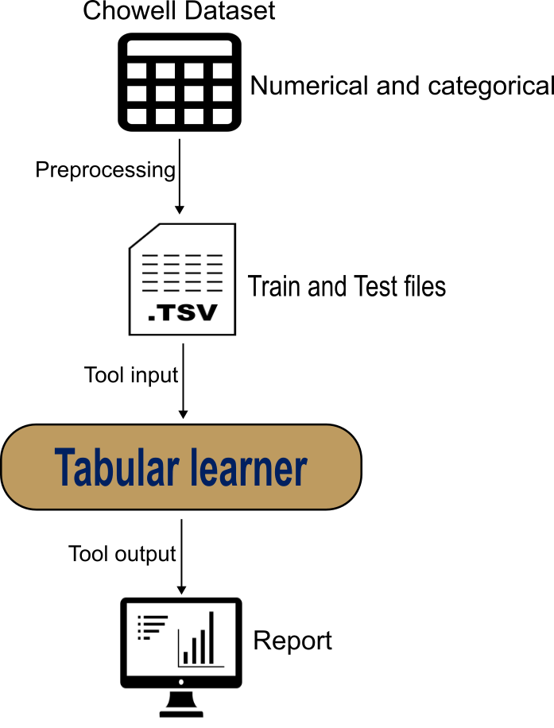
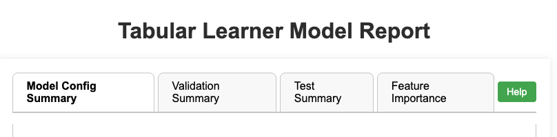
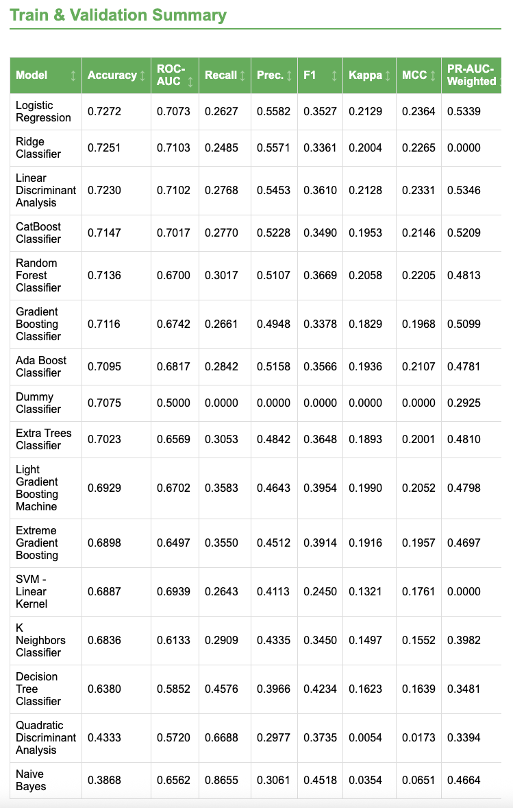
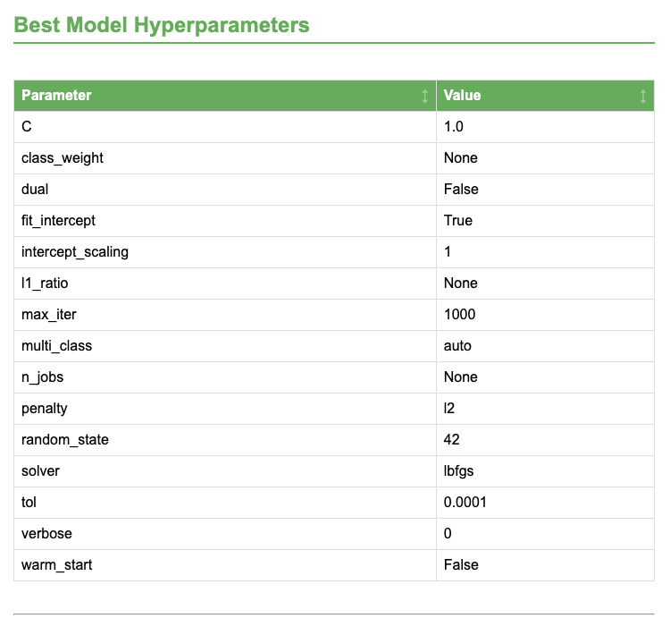
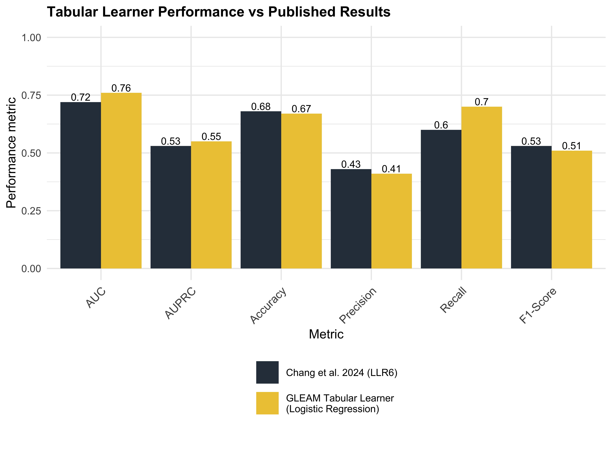

> <comment-title>Tabular Learner Tool</comment-title>
>
> The Tabular Learner tool described in this tutorial is currently available only on: 
> [Cancer-Galaxy](https://cancer.usegalaxy.org) >
> Galaxy-ML tools > Tabular Learner
>
> and [Galaxy US Server](https://usegalaxy.org)
> Statistics and Visualization > Machine Lerning > Tabular Learner
>
{:  .comment}

In this tutorial, we will build a new immunotherapy-response classifier with Galaxy Tabular Learner using a comprehensive dataset of patients treated with immune checkpoint blockade (ICB) and non-ICB-treated patients across 18 solid tumor types. The goal is to accurately predict patient responses to the treatment.

Rather than re-implementing the original LORIS pipeline, we treat the published LORIS LLR6 logistic regression model as a benchmark and use the Tabular Learner report to confirm model quality and to understand where and why results differ ().

We will follow three steps: (i) upload the preprocessed training and test tables to Galaxy, (ii) run Tabular Learner to train and select a best model, and (iii) compare discrimination, calibration, and threshold-dependent behavior against the LORIS LLR6 reference using the interactive report.

{: style="width: 60%; display: block; margin-left: auto; margin-right: auto;"}

> <agenda-title></agenda-title>
>
> In this tutorial, we will cover:
>
> 1. TOC
> {:toc}
>
{: .agenda}

> <comment-title>Background</comment-title>
>
> The [LORIS dataset](https://github.com/rootchang/LORIS/blob/main/02.Input/AllData.xlsx) contains clinical, pathologic, and genomic features from a diverse cohort of patients, providing a foundation for robust analysis and model development. The raw dataset (xlsx) includes 10 distinct cohorts:
>
> Chowell_train, 2) Chowell_test, 3) MSK1, 4) MSK2, 5) Kato_panCancer, 6) Shim_NSCLC, 7) Vanguri_NSCLC, 8) Ravi_NSCLC, 9) Pradat_panCancer, 10) MSK_nonICB.
>
> To keep this tutorial concise, we will focus on the Chowell_train cohort for model training and the Chowell_test cohort for testing the PanCancer model.
>
{:  .comment}

# Dataset composition (features) to train the model 

Before we begin the hands-on session, here’s a brief explanation of the features we’ll be using. These features were selected based on the findings of Chang et al. (2024), who identified them as the most important for training the model.

It's important to note that other features were tested in different combinations and model architectures. However, the authors concluded that the six features selected are the most valuable for achieving the best model performance.

## TMB (Tumor mutation burden)
Tumor mutation burden (TMB) is defined as the total number of somatic mutations within a specified region of the tumor genome. It has been recognized as a biomarker for predicting the efficacy of immune checkpoint blockade (ICB) in solid tumors. The [U.S. Food and Drug Administration](https://www.fda.gov/) (FDA) has approved a threshold of 10 mutations per megabase (mut/Mb) as a biomarker for response to ICB treatment.

In this dataset, TMB values range from 0 to over 368 mutations per megabase, with some extreme values, such as 368.6 and 93.5. To mitigate the influence of these outliers, TMB values will be truncated at 50 mut/Mb, meaning any value exceeding 50 will be capped at 50. This is crucial because extreme TMB values can disproportionately skew the model’s learning process, leading to unreliable predictions.

## Systemic Therapy History
This feature is a binary variable that indicates whether a patient received chemotherapy or targeted therapy prior to immunotherapy. It is coded as 1 if the patient had undergone such treatments before starting immunotherapy, and 0 if they had not.

## Albumin
The albumin feature represents the albumin levels measured in patients, which is an important biomarker often associated with nutritional status and liver function. The values are measured in grams per deciliter (g/dL) and typically range between 2.1 and 4.9 g/dL in the dataset. Higher levels of albumin are generally associated with better overall health and can serve as an indicator of a patient's ability to recover or respond to treatments like immunotherapy.

## Cancer Type
The CancerType feature represents the type of cancer diagnosed in each patient, which can vary significantly across the dataset. Common types include Non-Small Cell Lung Cancer (NSCLC), Small Cell Lung Cancer (SCLC), Melanoma, Endometrial cancer, and other cancer types such as Gastric, Colorectal, Renal, and Breast cancer. This feature is critical for understanding the heterogeneity of the patient cohort and may influence treatment decisions, response rates, and outcomes.

Incorporating this feature into a machine learning model requires translating the categorical CancerType into one-hot encoded variables. Each cancer type will be represented as a binary feature (0 or 1), with each type becoming a separate column in the dataset. This enables the model to interpret the presence or absence of a specific cancer type for each patient.

## NLR (blood neutrophil–lymphocyte ratio)
The neutrophil–lymphocyte ratio (NLR), a biomarker derived from the ratio of neutrophils to lymphocytes in the blood, is increasingly used in cancer research due to its association with inflammation and immune response. It can serve as a prognostic factor in various cancer types. Higher NLR values often indicate a poorer prognosis, potentially reflecting a more aggressive disease or impaired immune response.

In this dataset, NLR values range, for example, from 0.8 to 88, with several extreme outliers. To address this, NLR values will be truncated at 25, meaning any value above 25 will be capped at 25. This truncation is important for preventing extreme outliers from disproportionately influencing the machine learning model.

## Age
In predictive models for patient outcomes, age is a crucial feature because it is often correlated with various health factors and disease risks. As people age, their immune systems, metabolism, and ability to recover from illnesses may change, influencing how they respond to treatments, medications, or disease progression. Including age as a feature helps models account for the biological changes that occur over time and can improve the accuracy of predictions across different age groups.

However, there are limits to how predictive age might be, particularly for extreme values. For example, patients over a certain age may share similar health characteristics, and further increases in age may not significantly add predictive value. Truncating age to a maximum value (like 85) helps avoid overemphasizing small differences between very old patients, where the added predictive power might be negligible.

## Response
The Response feature is a categorical target variable indicating whether patients benefited from immune checkpoint blockade (ICB) therapy, classified as 0 (no benefit) or 1 (benefit). The model is trained using all previous features to predict patient outcomes when ICB is chosen as the treatment.

# Model Architecture Selection Process

In the article (), the model was trained using different architectures, including Decision Tree, Random Forest, Logistic Regression, and XGBoost, using the scikit-learn framework (full code is available here: [Chang et al., github repo](https://github.com/rootchang/LORIS/tree/main/code). In the end, the best model architecture was a Logistic LASSO (Least Absolute Shrinkage and Selection Operator) Regression model, fitting the six features discussed above. This model was named LLR6.

It is important to note that Tabular Learner has the capability of training different model architectures, just as was done by Chang et al., 2024, but automatically.There are two options:
1. **Tool-selected best model**: let Tabular Learner compare candidate classifiers and select the strongest performer under its evaluation protocol.
2. **Model specific**: if you want a model family, restrict the candidate list to specific algorithms via the tool option: `Only Select Classification Models if you don't want to compare all models,`.

Since the purpose of this tutorial is not to replicate the exact model, we will not use the model specific option. Instead, we will train all candidate models. We therefore expect to obtain results similar to those reported by Chang et al., with logistic regression performing best among the models evaluated.

# Prepare environment and get the data 
> <comment-title>Preprocessing the raw data</comment-title>
>
> The raw data published by () can be found here: 
> [LORIS raw dataset](https://github.com/rootchang/LORIS/blob/main/02.Input/AllData.xlsx)
> 
> We preprocessed the raw data using a Python script to:
> 1) Extract the `Chowell_train` and `Chowell_test` tab from the excel file.
> 2) Select the 7 features (`TMB`, `Systemic Therapy History`, `Albumin`, `Cancer Type`, `NLR`, `Age`, and `Response`) important for building the model.
> 3) Truncate the values for `Age`, `NLR`, and `TMB`.
> 4) Encode `Cancer Type` using one-hot encoding. 
> 5) Save the dataset as a .tsv file.
>
> A Jupyter notebook for preprocessing can be found at Dockstore: [LORIS_preprocessing](https://dockstore.org/notebooks/github.com/paulocilasjr/pycaret-use-case/preprocessing:main?tab=info)
>
{:  .comment}

> <hands-on-title> Environment and Data Upload </hands-on-title>
>
> 1. Create a new history for this tutorial. If you are not inspired, you can name it *LORIS model classifier*.
>
>    
>
> 2. Import the files from Zenodo or from the shared data library
>
>    ```
>    https://zenodo.org/records/13885908/files/Chowell_train_Response.tsv
>    https://zenodo.org/records/13885908/files/Chowell_test_Response.tsv
>    ```
>>   <tip-title>Data Type</tip-title>
>>   Leave the `Type` field as `Auto-Detect` when uploading (it's the default).
>>
>    {: .tip}
>    
>
> 3. Check that the data format assigned for the file is **tabular**.
>    If it is not, follow the Changing the datatype tip.
>
>    
>
> 5. Add a tag (`LORIS model dataset`) to the dataset corresponding to `Chowell_train_Response.tsv` and `Chowell_test_Response.tsv`
>    This is important to trace back on what dataset the model was built on.
>
>    
>
{: .hands_on}

# Using Tabular Learner Tool
> <hands-on-title> Run 1: train a Tabular Learner model </hands-on-title>
>
> 1.  with the following parameters:
>    -  *"Input Dataset (CSV or TSV)"*: `Chowell_train_Response.tsv`
>    -  *"Test Dataset (CSV or TSV)"*: `Chowell_test_Response.tsv`
>    -  *"Select the target column"*: `C22: Response`
>    -  *"Task"*: `Classification`
>
> 2. Run the tool 
{: .hands_on}

> <hands-on-title> Run 2: Re-evaluate at a selected decision threshold </hands-on-title>
>
> Threshold-dependent metrics (accuracy, precision, recall, F1, MCC) change when the probability cutoff changes. For a transparent comparison to LORIS LLR6, do the following: 
>
> 1.  with the following parameters:
>    -  *"Input Dataset (CSV or TSV)"*: `Chowell_train_Response.tsv`
>    -  *"Test Dataset (CSV or TSV)"*: `Chowell_test_Response.tsv`
>    -  *"Select the target column"*: `C22: Response`
>    -  *"Task"*: `Classification`
>    -  *"Customize Default Settings?"*: `Yes`
>    -  *"Classification Probability Threshold"*: `0.25`
>
> 2. Run the tool 
{: .hands_on}


# Tool output files
After training and testing your model, you should see two new files in your history list:

- Tabular Learner Best Model: An HDF5 file (`.h5`) that stores the serialized best model (and preprocessing) so it can be reused without retraining.

- Tabular Learner Model Report: An interactive HTML report with sortable tables and plots summarizing setup, validation, test results, and feature importance.

A hidden CSV with the best model's hyperparameters (`best_model.csv`) is also produced; show hidden datasets if you want to download it.

For this tutorial, we will focus on the Tabular Learner Model Report.

# Tabular Learner Model Report 
The Tabular Learner HTML report provides a comprehensive, browser-ready overview of the trained model and its evaluation, including performance on the training, validation, and test data. The report consists of four tabs: Model Config Summary, Validation Summary, Test Summary, and Feature Importance.


Below is a brief explanation of the content in each tab of the report.

> <tip-title>Model Config Summary Tab</tip-title>
>- Dataset Overview (classification only): Counts and percentages of each label in the train/validation/test splits.
>- Performance Summary (classification only): Train/validation/test metrics computed for the best model, using the selected probability threshold when applicable.
>- Setup Parameters: Records the key run settings (target column, train size, normalization, feature selection, cross validation, outlier/multicollinearity handling, polynomial features, class-imbalance handling, model list, and probability threshold).
>- Best Model Hyperparameters: The final parameter values for the selected model.
>
{: .tip}

> <tip-title>Validation Summary Tab</tip-title>
>- Train & Validation Summary: A sortable table comparing all candidate models on cross-validation metrics; includes a tuning summary when hyperparameter tuning is enabled.
>- Diagnostic Plots (vary by task and model availability): Learning curve, validation curve, calibration curve (classification), threshold plot (classification), and dimensionality-reduction or feature-selection visuals (e.g., t-SNE, manifold, RFE).
>
{: .tip}

> <tip-title>Test Summary Tab</tip-title>
>- Test Metrics Table: Holdout/test performance for the selected model.
>- Classification Plots: Confusion matrix, per-class report, ROC and PR curves (optionally annotated at the chosen threshold), lift curve, and cumulative precision.
>- Regression Plots: Residuals plot and prediction error distribution, plus a preview of true vs. predicted values.
>
{: .tip}

> <tip-title>Feature Importance Tab</tip-title>
>- Model-based Importance: Feature importance from the selected model (tree-based or coefficient-based when supported), with a SHAP summary plot to show global impact.
>- SHAP and Permutation Importance: Mean absolute SHAP impact and permutation importance derived from the explainer.
>- Partial Dependence Plots (PDPs): Per-feature effect plots to show how individual features influence predictions.
>- Feature Scope Table: Reports how many transformed features are used in SHAP when feature caps are applied.
>
{: .tip}

# Benchmarking Tabular Learner against the LORIS LLR6 model

The objective of this use case is to build a **new** model with Tabular Learner under a standardized Galaxy workflow and then use the published LORIS LLR6 model as a **benchmark baseline** (). Because both approaches use the same cohort split and predictor set, agreement in threshold-independent metrics (ROC-AUC, PR-AUC) supports model fidelity, while any differences in threshold-dependent metrics can often be explained by distinct probability cutoffs, calibration, or regularization choices recorded in the report.

> <tip-title>Robustness definition </tip-title>
>
> Some evidence is considered robust if it holds up across reasonable variations in analysis, while fragile evidence depends heavily on specific analytical choices, such as the inclusion or exclusion of certain observations or covariates.
>
> Robustness, therefore, refers to assessing the reliability of previous findings by applying different analytical approaches to the same dataset.>
>
>
{: .tip}

## Classification Algorithms
A key feature of Tabular Learner is its capability to train and compare multiple models with minimal code. By default, Tabular Learner evaluates a diverse range of algorithms, including linear models, tree-based models, and ensemble methods, ranking these models based on their performance. The primary metric used to determine the best-performing model is the accuracy.



In many runs of this use case, logistic regression ranks among the top-performing models, consistent with the LORIS LLR6 baseline.

## Hyperparameters
The model from  for the Pan-Cancer LLR6 model has the following hyperparameters set: C = 0.1, Class Weight = Balanced, L1 ratio = 1, max iter = 100, Penalty = Elasticnet, Solver = Saga.

The hyperparameter search performed by Galaxy-Tabular Learner resulted in slightly different settings for the model: C = 1.0, Class Weight = None, L1 ratio = None, max iter = 1000, Penalty = L2, Solver = LBFGS.



The differences found in the hyperparameters guide the analysis towards testing the robustness of the LORIS Score proposed by .

> <comment-title>Hyperparameters meaning</comment-title>
>
> *Penalty* - Defines the type of regularization applied to the model to prevent overfitting. Options for linear and logistic regression are: `L1`, `L2`, and `Elasticnet`. Briefly, L1 (Lasso Regression) removes less important features, helping to overcome overfitting as well as performing dimension reduction. However, when most features (variables) in the model are useful, L2 (Ridge Regression) is used. Elasticnet regularization combines both L1 and L2, addressing multicollinearity while also enabling feature selection. When Elasticnet is selected, it opens the L1 Ratio parameter.
>
> *L1-Ratio* - Controls the balance between L1 and L2 penalties. A value of `1` uses purely L1 regularization, which encourages sparsity. A value of `0` uses purely L2.
>
> *C* - Is the inverse of the regularization strength. A smaller C (like `0.1`) implies stronger regularization, which prevents overfitting by penalizing large coefficients and also makes the model simpler (smaller coefficients). In contrast, higher values make the model more complex.
>
> *Solver* - Specifies the optimization algorithm used for fitting the model. `SAGA` is well-suited for large datasets and supports the Elasticnet penalty. It is also effective for sparse data and is fast for L1. `LBFGS` is a quasi-Newton optimization algorithm, efficient for smaller datasets, supports L2 regularization, but does not support Elasticnet.
>
> *Class Weight* - Is used to handle imbalanced classes by adjusting the weight associated with each class. Balanced adjusts these weights inversely proportional to class frequencies in the data, giving more weight to the minority class.
>
> *Max Iter* - Specifies the `maximum number` of iterations the solver will run before stopping. If convergence is achieved earlier, it will stop; if not, you may need to increase the value.
>
{:  .comment}

## Model Evaluation Metrics

When comparing Tabular Learner models to LORIS LLR6, separate metrics into two groups and compare both runs of Tabular Learner:

1. **Threshold-independent (primary for benchmarking)**  
   - **ROC-AUC** and **PR-AUC** summarize discrimination across all thresholds. In this use case, both Tabular Learner runs show stronger discrimination than LLR6 (AUC 0.76 vs 0.72; AUPRC 0.55 vs 0.53), and the two runs are identical on these metrics because the underlying model and data did not change.

2. **Threshold-dependent (report with the chosen cutoff)**  
   - **Accuracy and F1** shift when the probability cutoff changes. Moving from 0.50 (Run 1) to 0.29 (Run 2) lowers accuracy (0.79 → 0.67) but improves F1 (0.42 → 0.52).

The table below summarizes the key numbers:

| Model | Threshold | Accuracy | ROC-AUC | PR-AUC | F1 |
| --- | --- | --- | --- | --- | --- |
| LLR6 (reference) | 0.30 | 0.68 | 0.72 | 0.53 | 0.53 |
| Tabular Learner Run 1 | 0.50 | 0.80 | 0.76 | 0.55 | 0.42 |
| Tabular Learner Run 2 | 0.25 | 0.67 | 0.76 | 0.55 | 0.52 |

Use the following report components to interpret differences:

- **Model Config Summary**: confirm the split strategy, evaluation protocol, selected model, and tuned hyperparameters.
- **ROC and PR curves**: compare discrimination against the published baseline without relying on a specific threshold.
- **Calibration plot and probability diagnostics**: determine whether predicted probabilities are systematically over- or under-confident.
- **Threshold plot (precision/recall/F1 vs cutoff)**: select and justify an operating point (for example, maximize F1, or prioritize recall for clinical sensitivity).
- **Confusion matrix and classification report**: quantify how the chosen cutoff changes false positives and false negatives.



- Accuracy
Accuracy measures the proportion of correct predictions among all predictions. In our experiments, Tabular Learner Run 1 achieved the highest accuracy (0.80), substantially higher than the published reference model LLR6 (0.68) and Run 2 (0.67). This indicates that, at its selected operating threshold, Run 1 produced more correct classifications overall. However, because accuracy depends on the chosen cutoff and can be influenced by class imbalance, it should be interpreted alongside threshold-dependent metrics (e.g., F1) and threshold-independent metrics (e.g., ROC-AUC, PR-AUC).

- Area Under the Curve (AUC)
ROC-AUC summarizes discrimination across all possible thresholds. Both Tabular Learner runs show higher ROC-AUC (0.76) than the published LLR6 baseline (0.72), indicating improved ability to rank positives above negatives irrespective of where the cutoff is set. Despite Run 1 having much higher accuracy than Run 2, their identical ROC-AUC suggests that the key difference is likely where the decision threshold was placed, rather than a large difference in underlying separability.

- Precision-Recall AUC (AUPRC)
Precision-Recall AUC (AUPRC or PR-AUC) is often more informative than ROC-AUC when positives are relatively rare. Both Tabular Learner runs have PR-AUC = 0.55, slightly higher than the reference (0.53), suggesting a modest improvement in performance in the precision–recall tradeoff over the baseline, independent of a single threshold choice.

- Threshold selection and F1 (Run 1 vs Run 2 vs reference)
The threshold determines the balance between false positives and false negatives. Although Run 1 attains higher accuracy, it has a lower F1 (0.42) than Run 2 (0.52) and the reference LLR6 (0.53). This pattern is consistent with Run 1 using a more conservative cutoff (0.50), which typically increases true negatives (improving accuracy) but can reduce recall and harm F1 if positives are missed. In contrast, Run 2 uses a lower threshold (0.25), which generally increases sensitivity and can improve F1 by capturing more positives, even if it introduces more false positives and lowers overall accuracy.The comparison between the Tabular Learner and Scikit-learn models demonstrates consistent performance across multiple evaluation metrics, such as accuracy, AUC, and F1 score. The slight differences in the results reflect the inherent flexibility of the LORIS Score, showing that a model built using two different frameworks—Tabular Learner and Scikit-learn—can still yield comparable performance.

Compared to the published model, our runs demonstrate that while discrimination (ROC-AUC/PR-AUC) is slightly improved, the choice of threshold materially changes the reported point metrics. Therefore, differences in accuracy and F1 across Run 1, Run 2, and LLR6 should be interpreted primarily as different operating points on similar underlying probability rankings, rather than as contradictions in model quality.

Overall, these results emphasize that (1) ROC-AUC and PR-AUC support comparability with, and slight improvement over, the published baseline, and (2) threshold selection must be explicitly justified because it can shift the balance between accuracy and clinically relevant sensitivity/precision, leading to substantially different conclusions from the same model outputs.

# Conclusion
In this tutorial, we demonstrated how to use the Galaxy-Tabular Learner Tool to build a machine learning model for ICB treatment patient selection using clinical data. We followed a structured approach consisting of:
- Uploading datasets (.tsv)
- Running the Tabular Learner
- Evaluating the model's performance using the metrics published by  as the gold standard.

Throughout the process, we showcased how Tabular Learner simplifies the complexities of machine learning workflows, making them more accessible and efficient for users. Additionally, we explored the robustness of the LORIS Score by building a Logistic Regression model with different hyperparameters.

By the end of this tutorial, you should have a solid understanding of how to deploy a traditional machine learning model using tabular data and effectively interpret its results.
