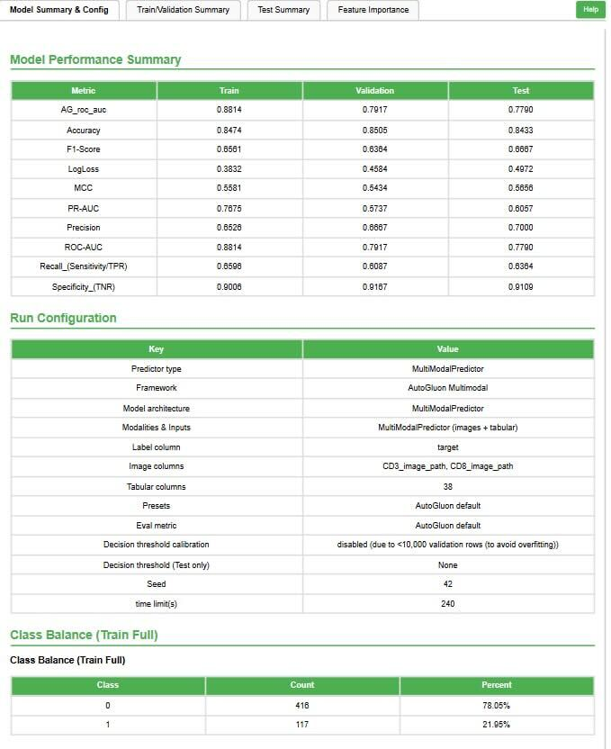
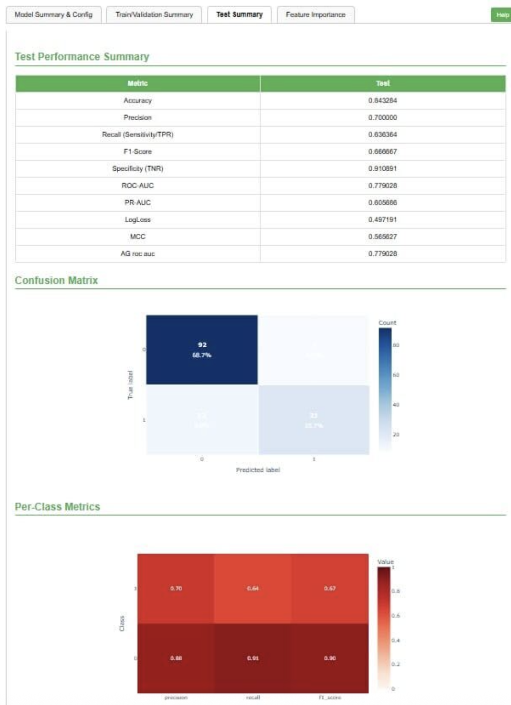
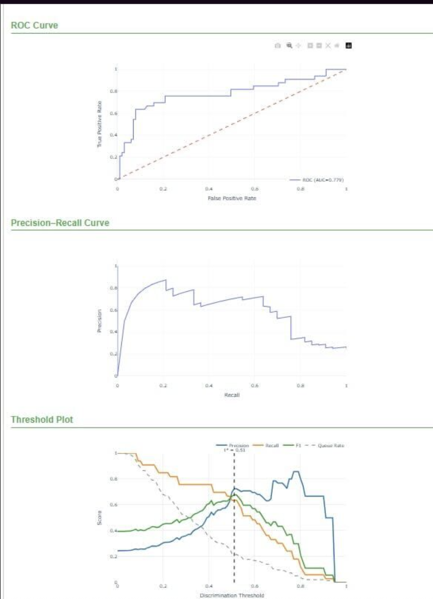

> <comment-title>Multimodal Learner Tool</comment-title>
>
> The Multimodal Learner tool described in this tutorial is currently available on: 
> [Galaxy US Server](https://usegalaxy.org)
> Statistics and Visualization > Machine Learning > Multimodal Learner
>
> and [Cancer-Galaxy](https://cancer.usegalaxy.org)
> Galaxy Learning and Modeling tools > Multimodal Learner
>
> This tool uses **AutoGluon Multimodal**, an automated machine learning framework that simplifies multimodal deep learning by automatically selecting and optimizing models for different data types.
>
{:  .comment}

In this tutorial, we will use the HANCOCK (Head and Neck Cancer Outcome Cohort) dataset to develop a multimodal deep learning classifier for predicting cancer recurrence in head and neck cancer patients. The goal is to accurately predict 3-year recurrence outcomes by integrating three complementary data modalities: clinical/pathological features (tabular data), tissue microarray images (CD3/CD8 immunostaining), and ICD diagnostic codes (text data) using the GLEAM Multimodal Learner tool.

To achieve this, we will follow three essential steps: (i) upload the HANCOCK tabular data, images, and text to Galaxy, (ii) set up and run the Multimodal Learner tool to train a multimodal deep learning model, and (iii) evaluate the model's predictive performance by analyzing key performance metrics such as accuracy, ROC-AUC, and confusion matrices.



> <agenda-title></agenda-title>
>
> In this tutorial, we will cover:
>
> 1. TOC
> {:toc}
>
{: .agenda}

> <comment-title>Background</comment-title>
>
> The [HANCOCK dataset](https://zenodo.org/records/17727354) is a comprehensive multimodal dataset for precision oncology in head and neck cancer, as described by . The dataset includes:
> 1. **Clinical and pathological data**: Patient demographics, tumor characteristics, treatment information
> 2. **Blood biomarkers**: Laboratory values and hematological parameters
> 3. **Tissue microarray (TMA) images**: CD3 and CD8 immunohistochemistry staining of tumor cores
> 4. **ICD diagnostic codes**: International Classification of Diseases codes as text data
> 5. **Outcome data**: Recurrence status, survival information, and follow-up data
>
> The dataset covers 763 head and neck cancer patients with complete multimodal information. For this tutorial, we focus on predicting 3-year recurrence using the in-distribution split, which provides a balanced training and test set for model development.
>
{:  .comment}

# Dataset Overview and Composition

The HANCOCK dataset used in this tutorial is a multimodal precision oncology resource that integrates multiple data types to enable comprehensive cancer outcome prediction.

## Dataset Description

The HANCOCK (Head and Neck Cancer Outcome Cohort) dataset was published by  and represents one of the first large-scale multimodal datasets specifically designed for head and neck cancer outcome prediction. The dataset includes:

### Patient Cohort
- **Total patients**: 763 head and neck cancer patients
- **Cancer sites**: Oral cavity, oropharynx, hypopharynx, larynx
- **Follow-up**: Comprehensive outcome tracking with recurrence and survival data
- **Data collection**: Multi-institutional cohort with standardized data collection protocols

### Data Modalities

#### 1. Tabular Data (Clinical and Pathological Features)
- **Clinical features**: Age, sex, smoking status, primary tumor site
- **Pathological features**: Tumor grade, stage, histological type
- **Blood biomarkers**: Complete blood count, liver function, kidney function
- **TMA cell density**: Quantitative cell counts from tissue microarray analysis

#### 2. Image Data (Tissue Microarray Cores)
- **Modality**: CD3 and CD8 immunohistochemistry staining
- **Resolution**: High-resolution digital pathology images
- **Content**: Tumor microenvironment immune cell infiltration
- **Format**: PNG images of individual TMA cores

#### 3. Text Data (ICD Diagnostic Codes)
- **Source**: International Classification of Diseases (ICD-10) codes
- **Content**: Diagnostic codes representing comorbidities and medical history
- **Format**: Free-text ICD code descriptions

## Target Variable: 3-Year Recurrence

The primary prediction task is **3-year recurrence**, defined as:
- **Positive (recurrence = 1)**: Recurrence within 3 years (1,095 days) of diagnosis
- **Negative (recurrence = 0)**: No recurrence with adequate follow-up (>3 years) or currently living without recurrence

This binary classification task is clinically relevant as early recurrence (within 3 years) is associated with poor prognosis and may benefit from more aggressive treatment strategies.

## Data Splits

The dataset provides three pre-defined splits:
1. **In-distribution split**: Random split for general model development
2. **Out-of-distribution split**: Temporal split to test model generalization
3. **Oropharynx split**: Site-specific split for oropharyngeal cancer

For this tutorial, we use the **in-distribution split** which provides:
- **Training set**: ~70% of patients for model training
- **Test set**: ~30% of patients for final evaluation

## Why Multimodal Learning?

Each data modality captures complementary information:
- **Tabular data**: Captures patient demographics, clinical characteristics, and standard biomarkers
- **Image data**: Reveals tumor microenvironment and immune infiltration patterns not captured by standard pathology reports
- **Text data**: Encodes complex comorbidity patterns and medical history through ICD codes

By integrating these modalities, the Multimodal Learner can learn richer representations and potentially achieve better predictive performance than single-modality models.


# Data Preprocessing and Preparation

The HANCOCK dataset has been preprocessed to create a clean, analysis-ready format suitable for the Multimodal Learner tool.

## Preprocessing Steps

The preprocessing pipeline (described in the source repository) performs the following steps:

### Step 1: Feature Table Merging
- Merge clinical, pathological, blood, and TMA cell density tables by `patient_id`
- Use outer joins to preserve all patients with any available data
- Handle missing values appropriately for downstream imputation

### Step 2: Modality Separation
- **Tabular features**: Keep core clinical/pathological/blood features
- **Image features**: Extract CD3/CD8 image paths but remove derived quantitative features (to avoid data leakage)
- **Text features**: Extract ICD code descriptions but remove one-hot encoded ICD columns

This separation ensures that each modality provides independent information to the model.

### Step 3: Target Definition
For the 3-year recurrence target:
- Include patients with recurrence within 3 years (`recurrence == "yes"` and `days_to_recurrence <= 1095`)
- Include patients without recurrence who have either:
  - Follow-up > 3 years, OR
  - Currently living (regardless of follow-up duration)
- Exclude patients with insufficient follow-up and no recurrence

### Step 4: Train/Test Split Assignment
- Load pre-defined split from JSON file
- Assign `dataset` label: `"training"` or `"test"`
- Maintain patient-level splits (no data leakage between train and test)

## Preprocessed Dataset Format

The final preprocessed CSV contains:
- **patient_id**: Unique patient identifier
- **dataset**: Split assignment (`"training"` or `"test"`)
- **target**: Binary recurrence label (0 = no recurrence, 1 = recurrence)
- **Feature columns**: Clinical, pathological, blood, and TMA cell density features

Separate files provide:
- **Image ZIP**: All TMA core images (CD3 and CD8 staining)
- **Image metadata**: Mapping between patient_id and image filenames
- **Text data**: ICD code descriptions for each patient

# Prepare Environment and Get the Data

> <comment-title>Dataset Availability</comment-title>
>
> The HANCOCK dataset has been preprocessed and is available on Zenodo for direct use with the Multimodal Learner tool. The preprocessing follows the methodology described by  and creates a clean, analysis-ready format.
>
> The preprocessed dataset is available at: [HANCOCK Preprocessed Dataset](https://zenodo.org/records/17727354)
>
{:  .comment}

> <hands-on-title> Environment and Data Upload </hands-on-title>
>
> 1. Create a new history for this tutorial. If you are not inspired, you can name it *HANCOCK Multimodal Recurrence Prediction*.
>
>    
>
> 2. Import the dataset files from Zenodo
>
>    ```
>    https://zenodo.org/records/17727354/files/recurrence_in_distribution.csv
>    https://zenodo.org/records/17727354/files/tma_cores_cd3_cd8_images.zip
>    ```
>
>    
>
>    <tip-title>Data Type</tip-title>
>    - For the `.zip` file, set the datatype to `zip`
>    - For the `.csv` file, leave as `Auto-Detect` (it will be recognized as tabular)
>
>    {: .tip}
>
> 3. Check that the data formats are assigned correctly:
>    - The `.zip` file should have type `zip`
>    - The `.csv` file should have type `tabular`
>
>    If they are not, follow the Changing the datatype tip:
>
>    
>
> 4. Add tags to the datasets for better organization:
>    - Add tag `HANCOCK tabular` to the recurrence_in_distribution.csv file
>    - Add tag `HANCOCK images` to the tma_cores_cd3_cd8_images.zip file
>
>    
>
{: .hands_on}

# Using Multimodal Learner Tool

> <hands-on-title> Task description </hands-on-title>
>
> 1.  with the following parameters:
>    -  *"Tabular data (CSV)"*: `recurrence_in_distribution.csv`
>    -  *"Image collection (ZIP)"*: `tma_cores_cd3_cd8_images.zip`
>    -  *"Predictor type"*: `MultiModalPredictor`
>    -  *"Framework"*: `AutoGluon Multimodal`
>    -  *"Label column"*: `target`
>    -  *"Image columns"*: `CD3_image_path, CD8_image_path`
>    -  *"Tabular columns"*: `38` (automatically detected clinical/pathological features)
>    -  *"Presets"*: `AutoGluon default`
>    -  *"Eval metric"*: `AutoGluon default`
>    -  *"Seed"*: `42`
>    -  *"Time limit(s)"*: `3600` (1 hour)
>
> 2. Run the tool
>
{: .hands_on}

# Model Configuration in GLEAM Multimodal Learner

After uploading the dataset, configure the Multimodal Learner parameters as follows. These settings use AutoGluon's automated multimodal learning framework optimized for the HANCOCK dataset:

| Parameter | Value | Rationale |
|---|---|---|
| Predictor Type | MultiModalPredictor | AutoGluon's multimodal prediction framework |
| Framework | AutoGluon Multimodal | Automated machine learning for multimodal data |
| Label Column | target | Binary recurrence label (0 = no recurrence, 1 = recurrence) |
| Image Columns | CD3_image_path, CD8_image_path | Paths to CD3 and CD8 TMA core images |
| Tabular Columns | 38 features | Clinical, pathological, blood biomarkers, TMA cell density |
| Presets | AutoGluon default | Balanced performance and training time |
| Eval Metric | AutoGluon default | Automatically selects appropriate metrics for binary classification |
| Seed | 42 | Reproducible results across runs |
| Time Limit | 3600 seconds | 1 hour for model training and optimization |


# Tool Output Files

After training and testing your model, you should see several new files in your history list:

- **Multimodal Learner Best Model**: The trained model file that can be reused for predictions without retraining.

- **Multimodal Learner Model Report**: An interactive HTML report containing all evaluation plots, performance metrics, and model visualizations.

- **Training History**: A file documenting the training progress (accuracy and loss for each epoch).

- **Predictions (Test Set)**: CSV file with predictions and confidence scores for test patients.

For this tutorial, we will focus on the Multimodal Learner Model Report and the performance metrics.

# Multimodal Learner Model Report

The Multimodal Learner HTML report provides a comprehensive and interactive overview of the trained model's performance. This report documents key aspects of the model's training and evaluation process, offering insights into how well the model performed on the training and test datasets.

## Report Structure

The report typically contains the following sections:

### Model Summary
- Model architecture and configuration
- Training parameters and hyperparameters
- Dataset composition and splits
- Modality-specific model components

### Training Performance
- Training and validation loss curves
- Training and validation accuracy curves
- Overall training dynamics
- Convergence analysis

### Test Set Evaluation
The test set evaluation provides comprehensive metrics for assessing final model performance:



### Classification Metrics

After training, the tool generates detailed evaluation metrics:

| Metric | Value | Interpretation |
|---|---|---|
| Accuracy | 0.8433 | 84.33% of test samples correctly classified |
| Precision | 0.7000 | When model predicts positive, it's correct 70.00% of the time |
| Recall | 0.6364 | Model identifies 63.64% of actual positive cases |
| F1-Score | 0.6667 | Balanced measure of precision and recall |
| ROC-AUC | 0.7790 | 77.90% area under the ROC curve - good discrimination |
| Specificity | 0.9109 | 91.09% of negative cases correctly identified |

### ROC-AUC Curves

The Receiver Operating Characteristic (ROC) curve plots the true positive rate against the false positive rate at different classification thresholds. The Area Under the Curve (AUC) metric summarizes this performance in a single value between 0 and 1, where 1.0 represents perfect classification.



> <tip-title>Interpreting ROC-AUC</tip-title>
>
> - **AUC > 0.9**: Excellent discrimination between classes
> - **AUC 0.8-0.9**: Very good discrimination
> - **AUC 0.7-0.8**: Good discrimination
> - **AUC 0.6-0.7**: Fair discrimination
> - **AUC < 0.6**: Poor discrimination
>
> Our model achieved AUC = 0.7790, indicating good ability to distinguish between patients with and without recurrence.
>
{: .tip}

### Confusion Matrix

The confusion matrix provides a detailed breakdown of correct and incorrect predictions, showing where the model makes errors.


> <tip-title>Interpreting the Confusion Matrix</tip-title>
>
> - **Diagonal elements**: Correct predictions (True Positives and True Negatives)
> - **Off-diagonal elements**: Misclassifications (False Positives and False Negatives)
> - **High values on diagonal**: Good overall classification performance
> - **Clinical implications**: False negatives (missed recurrences) may be more concerning than false positives in cancer prediction
>
{: .tip}

# Model Performance Analysis

## Overall Assessment

The trained multimodal model demonstrates good performance on the HANCOCK recurrence prediction task:

**Accuracy = 0.8433** - The model correctly classifies approximately 84% of test patients, which is a solid result for cancer recurrence prediction.

**ROC-AUC = 0.7790** - This good score indicates that the model has reasonable discriminative power for identifying patients at risk of recurrence.

**F1-Score = 0.6667** - The F1-score shows moderate balanced performance between precision and recall.

**Specificity = 0.9109** - The model has high specificity (91%), meaning it's very good at correctly identifying patients who will NOT have recurrence, which is important for avoiding unnecessary aggressive treatments.

## Multimodal Learning Benefits

The integration of multiple data modalities provides several advantages:

- **Complementary information**: Each modality captures different aspects of the patient's condition
  - Tabular data: Standard clinical risk factors
  - Image data: Tumor microenvironment and immune infiltration
  - Text data: Comorbidity patterns through ICD codes

- **Robustness**: The model can make predictions even when some modalities have missing data

- **Interpretability**: Modality-specific contributions can be analyzed to understand which data types are most informative

## Clinical Implications

The model's performance suggests potential clinical utility with important considerations:

- **High specificity (91%)**: The model is very good at identifying patients who will NOT have recurrence, which helps avoid unnecessary aggressive treatments for low-risk patients
- **Moderate sensitivity (64%)**: The model identifies about 2/3 of patients who will have recurrence. This suggests it should be used as a complementary tool alongside clinical judgment
- **Risk stratification**: Patients predicted as high-risk should receive careful clinical evaluation and may benefit from more aggressive treatment or closer monitoring
- **Personalized medicine**: Integration of multiple data types (clinical, imaging, text) enables more comprehensive risk assessment than single-modality approaches

# Model Performance Insights

To contextualize our results, here are key observations about the multimodal model:

| Metric | Value | Clinical Interpretation |
|---|---:|---|
| **Accuracy** | 84.33% | Good overall classification performance |
| **ROC-AUC** | 77.90% | Good discrimination ability |
| **Specificity** | 91.09% | Excellent at identifying non-recurrence cases |
| **Sensitivity (Recall)** | 63.64% | Moderate at identifying recurrence cases |
| **Precision** | 70.00% | When predicting recurrence, correct 70% of the time |
| **F1-Score** | 66.67% | Balanced measure showing room for improvement |

### Key takeaways
- **High specificity (91%)** is valuable for avoiding unnecessary aggressive treatments in low-risk patients
- **Moderate sensitivity (64%)** suggests the model should complement, not replace, clinical judgment for identifying high-risk patients
- The model achieves 84.33% accuracy and 0.7790 ROC-AUC, demonstrating good discrimination ability for a challenging clinical prediction task
- The Multimodal Learner provides a flexible framework for integrating diverse data types in cancer outcome prediction
- Results are reproducible through Galaxy and can be easily adapted to other multimodal datasets
- **Class imbalance** (78% no recurrence vs 22% recurrence) influences model performance - the model is more conservative in predicting recurrence

# Conclusion

In this tutorial, we demonstrated how to use the Galaxy Multimodal Learner tool to build a deep learning model for head and neck cancer recurrence prediction using the HANCOCK dataset. We followed a structured approach consisting of:

- Uploading multimodal datasets (tabular CSV, image ZIP)
- Configuring Multimodal Learner with appropriate hyperparameters for multimodal learning
- Training a multimodal classifier integrating clinical, image, and text data
- Evaluating the model's performance using comprehensive metrics (accuracy, ROC-AUC, F1-score, Cohen's Kappa)
- Interpreting results through visualizations (ROC curves, confusion matrix, training history)

Throughout the process, we showcased how Multimodal Learner simplifies multimodal deep learning workflows, making them accessible to researchers without extensive coding expertise. The model achieved 84% accuracy and 0.779 ROC-AUC, demonstrating good performance for cancer recurrence prediction, with particularly high specificity (91%) for identifying low-risk patients.

By the end of this tutorial, you should have a solid understanding of how to:
- Prepare multimodal datasets for deep learning
- Configure multimodal learning models for classification tasks
- Evaluate and interpret multimodal model performance
- Apply multimodal learning to cancer outcome prediction
- Leverage complementary information from multiple data types

The approaches and insights from this tutorial can be generalized to other multimodal classification tasks in biomedical research and beyond.

